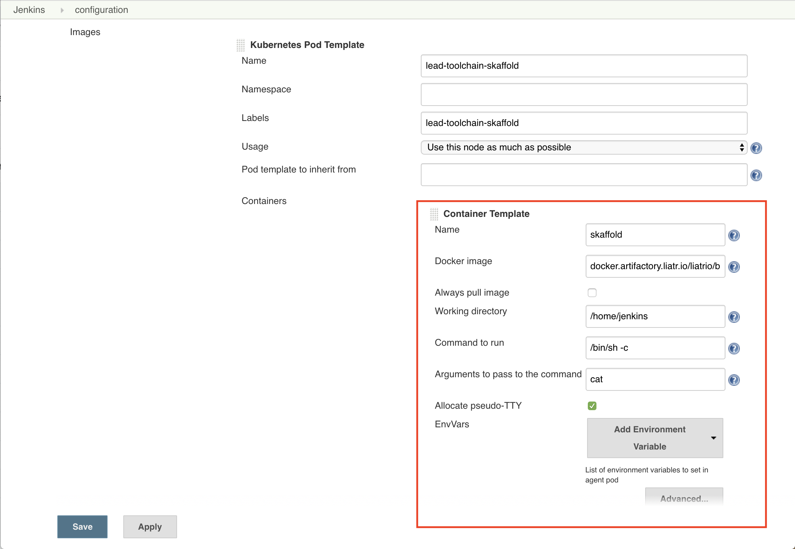

# Overview
This repo contains the source for builder images to be used as steps in CI/CD pipelines. An example of how these images are used can be seen in the image below.

### Images
 - [Skaffold](builder-image-skaffold)
   - Container built with Skaffold, Helm, and Container-structure-tests
 - [OpenShift](builder-image-openshift)
   - Container built with OpenShift and Helm
 - [Terraform](builder-image-terraform)
   - Container built with Terraform and Terragrunt
 - [Jenkins](jenkins-image)
   - Container for Jenkins that bakes in plugins

### Testing
Each directory for an image contains an image structure test to confirm that it will build correctly using the [Google Container Structure Test](https://github.com/GoogleContainerTools/container-structure-test) and Skaffold. You can test the container by running `skaffold run`
