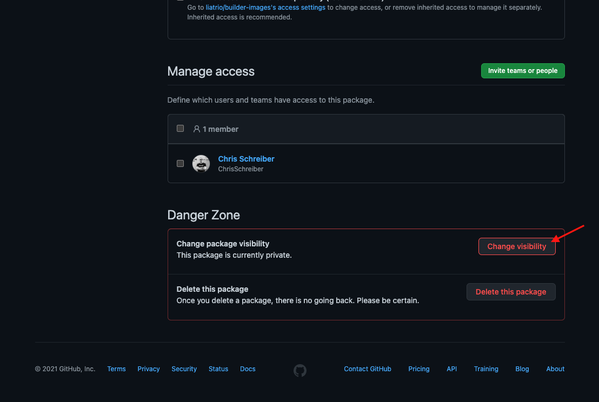
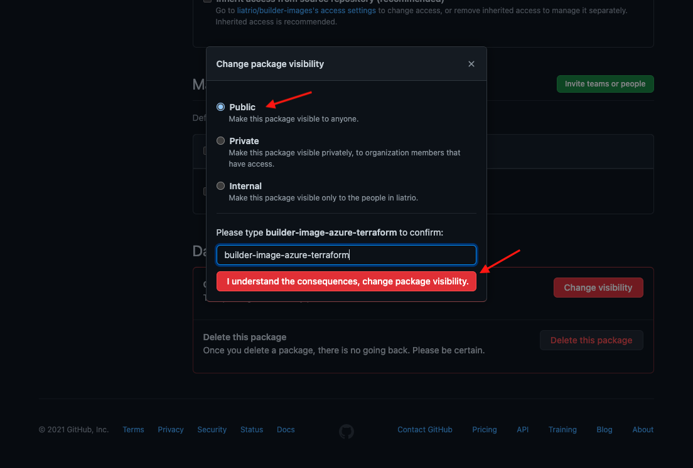
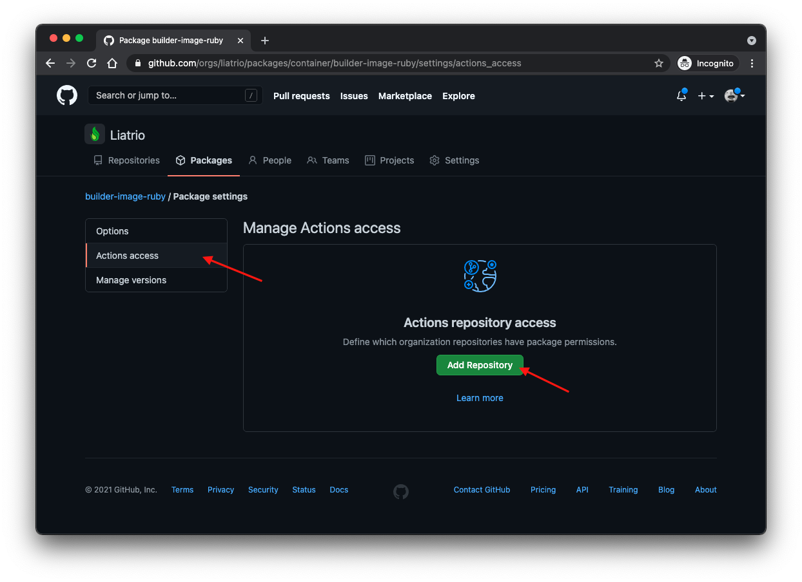
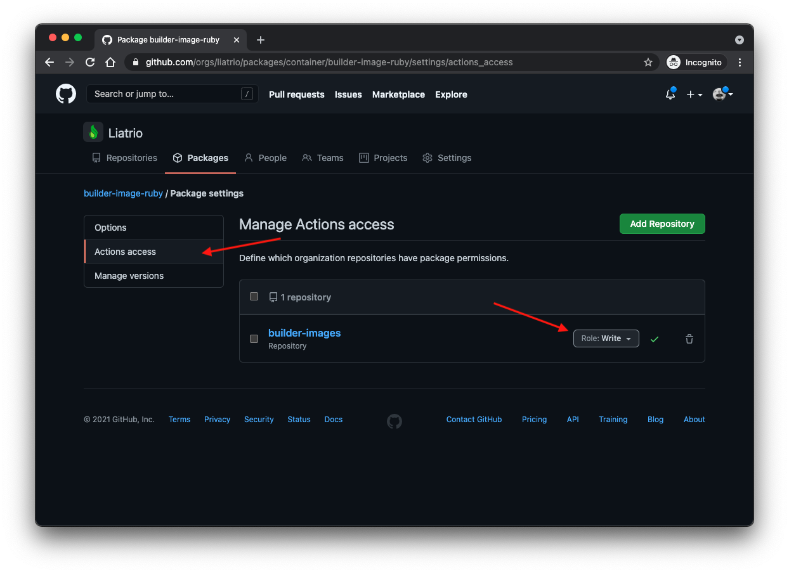

# Overview
This repo contains the source for builder images to be used as steps in CI/CD pipelines. An example of how these images are used can be seen in the image below.

Images are published to the Liatrio GitHub Container Registry (ghcr.io/liatrio) and are publicly visible to make them accessible across platforms. The list of published images is available on the [GitHub Packages](https://github.com/orgs/liatrio/packages) page.

### Images
[Skaffold](builder-image-skaffold): Container built with Skaffold, Helm, and Container-structure-tests

[OpenShift](builder-image-openshift): Container built with OpenShift and Helm

[Terraform](builder-image-terraform): Container built with Terraform and Terragrunt

[Jenkins](jenkins-image): Container for Jenkins that bakes in plugins

[aws](builder-image-aws)

[maven](builder-image-maven)

[ruby](builder-image-ruby)

[gradle](builder-image-gradle)

[Gitty Up](builder-image-gitty-up)

[Azure Terraform](builder-image-azure-terraform): Container for applying Terraform plan to Azure environment.

[Azure Terraform](runner-image-lead-terraform): Container used for running tests within the lead-terraform pipeline. 

### Testing
Each directory for an image contains an image structure test to confirm that it will build correctly using the
[Google Container Structure Test](https://github.com/GoogleContainerTools/container-structure-test) and Skaffold.
You can build and test all the containers by running `skaffold build` or `make`.

### Adding new images

In order for a new image to be published using the GitHub Action Workflow and publicly visible the GitHub package must be configured correctly.

First the package must exist and be linked to the builder-image repo. You do this locally by building and pushing the image locally.

1. Make sure the Dockerfile contains the following label `LABEL org.opencontainers.image.source https://github.com/liatrio/builder-images`
2. Log into the GitHub container registry with docker. [GitHub: Pushing and pulling Docker images](https://docs.github.com/en/packages/guides/pushing-and-pulling-docker-images#authenticating-to-github-container-registry)
3. Build and push the images by running `make all`

Now the package permission and visibility can be configured.

1. View the [Packages](https://github.com/orgs/liatrio/packages) in the Liatrio GitHub org and click on the image you want to make public.

2. Click the *Package Settings* button.

3. Click the *Change visibility* button

4. Select *Public* and confirm the change.

5. Select *Actions access* from the left menu and click the *Add Repository* button.

6. Enter `builder-images` and change the role to *Write*.

